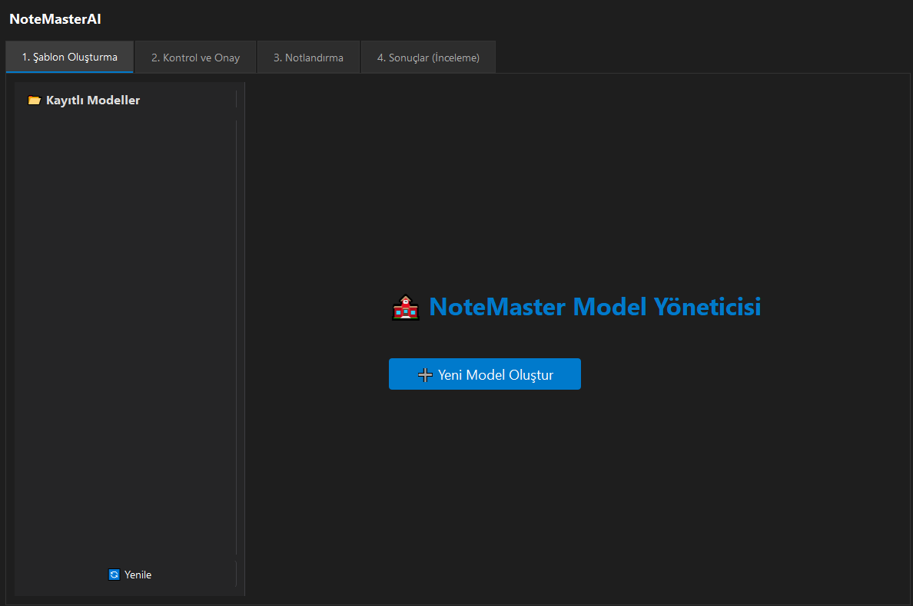
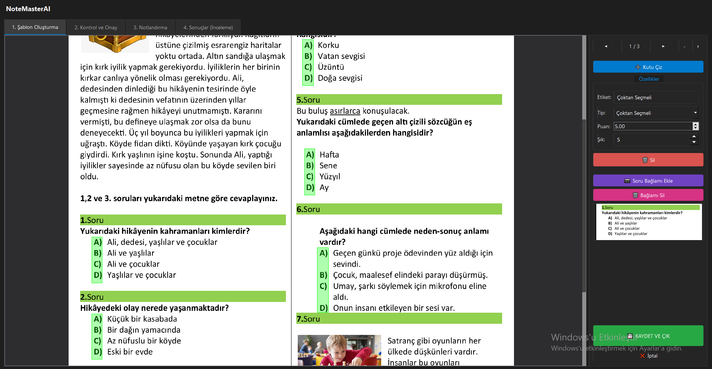
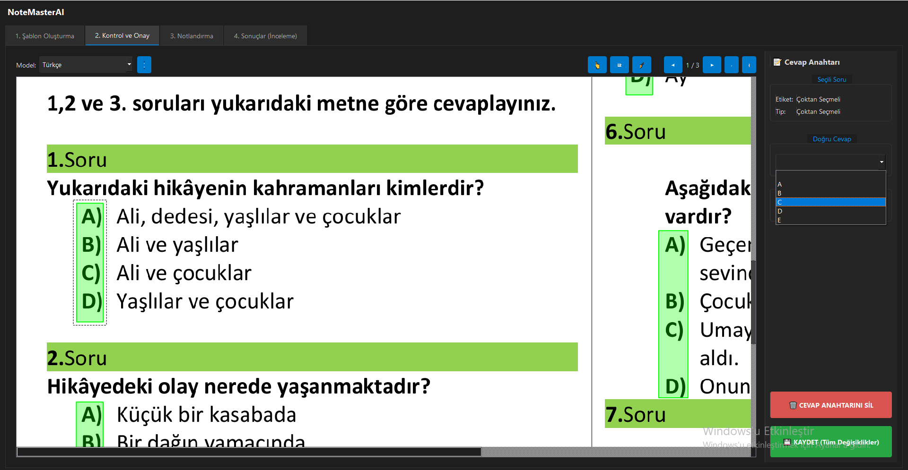

<p align="center">
  
  
  
  
  
  
  
  
</p>

# NoteMaster 🧠📄

**NoteMaster**, klasik sınav okuma ve notlandırma sürecini yapay zeka ile dijitalleştiren, **öğretmen-benzeri puanlama** yapabilen masaüstü ve mobil destekli bir sınav değerlendirme sistemidir.

Amaç; öğretmenin karar mantığını taklit eden, gerekçeli, kısmi puanlama yapabilen ve görsel bağlamı dikkate alan bir AI asistanı sunmaktır.

---

## 📸 Ekran Görüntüleri (Otomatik Galeri)

<p align="center">
  
  
  
</p>

---

## ✨ Temel Özellikler

### 🧠 Öğretmen-Benzeri AI Puanlama

* **Kısmi Puanlama:** Tek hata yüzünden 0 yok (0.25 / 0.50 / 0.75)
* **Gerekçeli Değerlendirme:**

  * "Tabloda 1 hata bulundu, %75 puan verildi"
* **Öğretmen Notları:**

  * Yazım yanlışlarını dikkate alma
  * Sadece sonuca bak
  * İşlem adımlarına puan ver

### 🖼️ Görsel Bağlamlı Analiz

* Grafik, tablo ve metin bağlamına göre değerlendirme
* Anti-halüsinasyon: Görselde yoksa uydurma yok

### 📄 Şablon (Model) Sistemi

* PDF tabanlı yeniden kullanılabilir sınav modelleri
* Soru bazlı puan, bölge ve AI talimatı

### 📱 Mobil Tarama Entegrasyonu

* Telefonun kendi kamera uygulaması
* Yüksek çözünürlük ve gece modu desteği
* Wi-Fi üzerinden otomatik PC aktarımı

### 🧪 Deneysel: Otomatik Soru Tespiti (YOLO)

* Yeni model oluştururken otomatik soru algılama
* Manuel düzenleme her zaman mümkün

### 📊 Raporlama

* Sınıf geneli analiz
* PDF ve Excel çıktıları

---

## 🛠 Kullanılan Teknolojiler

* Python 3.10+
* Flutter
* Google Gemini API
* Google Cloud Vision OCR
* OpenCV
* YOLO
* Poppler (PDF rendering)

---

## ⚙️ Kurulum

### Gereksinimler

* Python 3.10+
* Flutter SDK
* Google Cloud API Anahtarları

### API Ayarları

1. `service-account.json` dosyasını ana dizine ekleyin
2. Gemini API anahtarı ilk çalıştırmada sorulur veya `secrets.json` içine eklenir

```json
{
  "gemini_api_key": "YOUR_GEMINI_API_KEY"
}
```

> 🔐 API anahtarlarını repoya commit etmeyin.

---

### Masaüstü Uygulaması

```bash
cd NoteMaster/NoteMasterAI
pip install -r requirements.txt
python main_qt.py
```

### Mobil Uygulama

```bash
cd NoteMaster/NoteMasterMobile
flutter pub get
flutter run
```

---

## 👨‍💻 Geliştirici

**İbrahim Nuryağınlı**

---

## 📄 Lisans

Bu proje **MIT Lisansı** ile lisanslanmıştır.

> ✍️ Geliştirici Notu: AI bir hakem değil, öğretmenin karar sürecini destekleyen bir asistandır.
