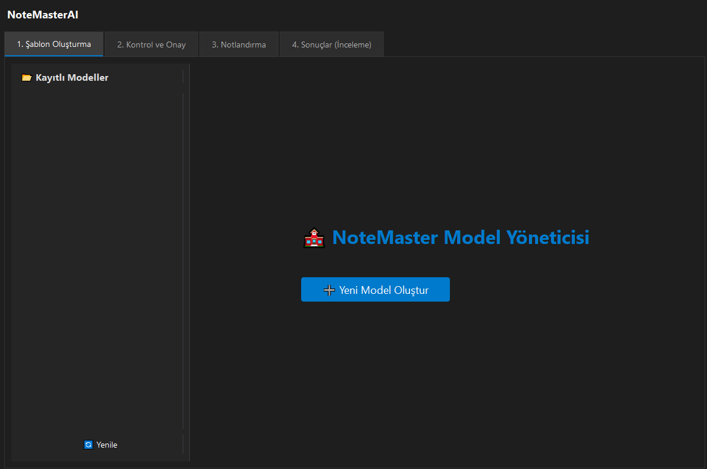
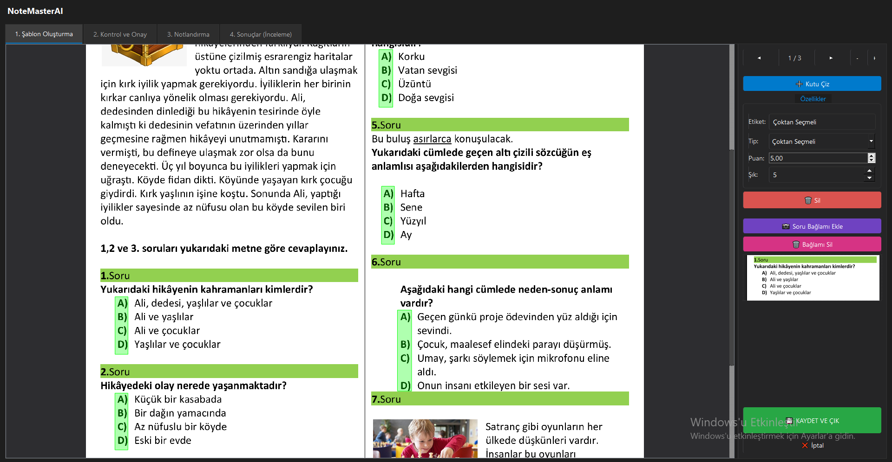
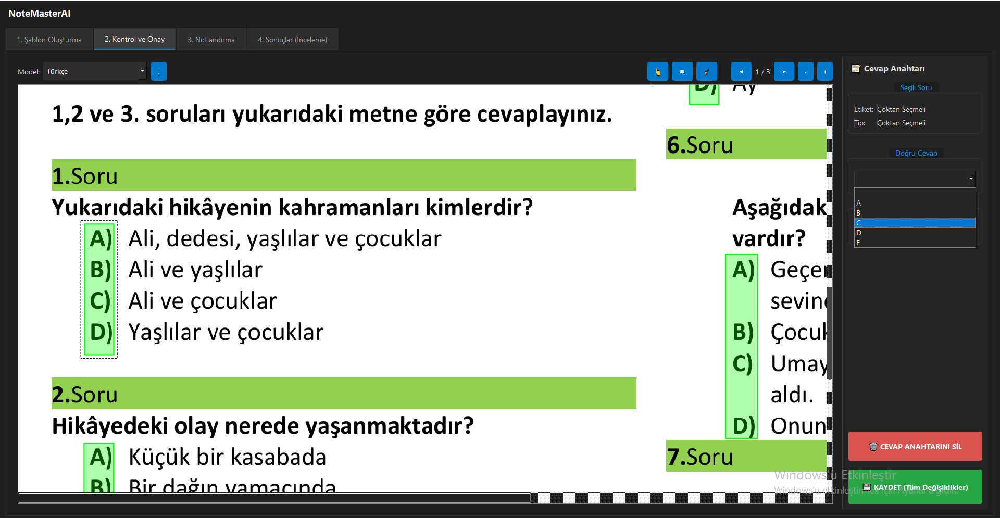

<p align="center">
  
  
  
  
  
  
  
  
</p>

# NoteMaster 🧠📄

**NoteMaster** is an intelligent exam grading and assessment system designed to digitize and automate the exam evaluation workflow. By utilizing AI and computer vision, NoteMaster mimics teacher-like grading decisions, providing detailed justifications, partial grading, and context-aware assessments via a combined desktop and mobile ecosystem.

---

## 📸 Screenshots

<p align="center">
  
  
  
</p>

---

## ✨ Key Features

### 🧠 Teacher-Like AI Grading
* **Partial Credit Evaluation:** Rather than simple binary correct/incorrect grading, the system evaluates logical progress (e.g., awarding 0.25, 0.50, or 0.75 points based on intermediate steps).
* **Justified Feedback:** The AI provides explicit reasons for its grading decisions (e.g., "One calculation error detected in the final step, 75% score awarded").
* **Custom Teacher Guidelines:** Instruct the AI to ignore spelling errors, grade based only on final results, or focus on specific process steps.

### 🖼️ Context-Aware OCR & Visual Analysis
* Evaluates students' work based on surrounding charts, tables, and handwritten annotations.
* Built-in anti-hallucination guardrails to prevent AI from inventing information not present in the scanned paper.

### 📄 Layout Template System
* Define custom reusable layout templates from blank PDF exams.
* Configure per-question point distributions, bounding box coordinates, and specialized instructions.

### 📱 Wireless Mobile Scan Client
* Use the companion mobile application to take high-resolution captures of physical exams.
* Auto-transfer scans to the desktop grading server in real-time over the local network (Wi-Fi).

### 🧪 Bounding Box Auto-Detection (YOLO)
* Instantly detect question boundaries using a custom-trained YOLO model.
* Trained on a hand-labeled dataset of over 750 custom exam sheets.
* [Dataset and YOLO Model Registry](https://universe.roboflow.com/erbascan/)

### 📊 Reports & Exporting
* Full classroom performance dashboards.
* Clean PDF export support for class grading results.

---

## 🛠 Tech Stack

* **Core Backend & Desktop GUI:** Python 3.10+, PyQt5
* **Mobile Client:** Flutter / Dart
* **Artificial Intelligence:** Google Gemini API (Multimodal LLM)
* **Computer Vision & OCR:** Google Cloud Vision API, OpenCV, YOLO
* **PDF Utility:** Poppler

---

## ⚙️ Configuration & Setup

### Prerequisites

* Python 3.10+
* Flutter SDK (for mobile client build)
* Google Cloud Platform account with Vision API access enabled
* Gemini API Key

### Credentials Setup

1. Place your Google Cloud Service Account credentials JSON file as `service-account.json` in the root folder.
2. Provide your Gemini API key during the initial launch or save it manually inside `secrets.json`:

```json
{
  "gemini_api_key": "YOUR_GEMINI_API_KEY"
}
```

> 🔐 **Security Note:** Never commit `secrets.json` or `service-account.json` to public version control.

---

## 🚀 Running the Applications

### Desktop Application (Server & Grading Interface)

```bash
cd NoteMasterAI
pip install -r requirements.txt
python main_qt.py
```

### Mobile App (Scanner Client)

```bash
cd NoteMasterMobile
flutter pub get
flutter run
```

---

## 📄 License

This project is licensed under the **MIT License**.
